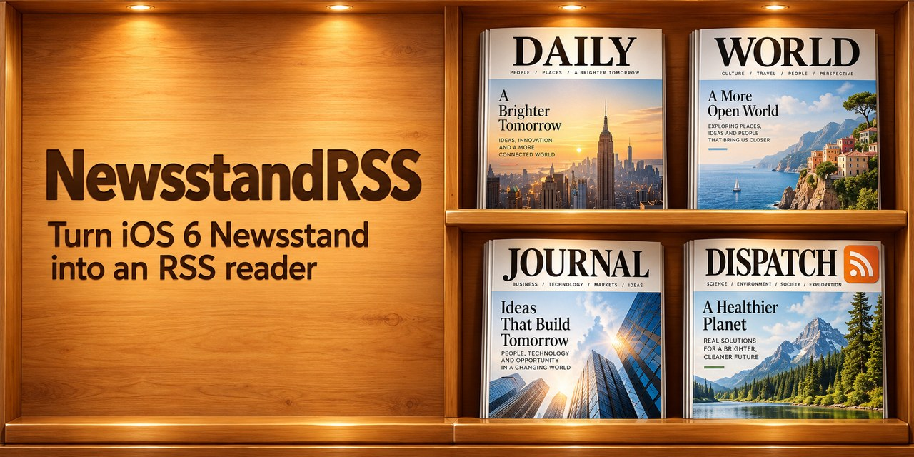

# NewsstandRSS



A rootful iOS 6 tweak that turns Newsstand into an RSS reader. A **+** button next to Newsstand's Store button
adds an RSS or Atom feed (or a website, whose feed is discovered automatically). Each feed becomes its own
magazine on the shelf, with a cover drawn from its latest headlines and article photo. Tapping a magazine opens
a reader with the article list and a clean article view. Package identifier: `com.aurelio.newsstandrss`.
Tested on an iPhone 4 (iPhone3,2) running iOS 6.1.3.

## Using it

- **Add**: Newsstand → **+**, type `example.com` or a feed address. Settings → NewsstandRSS → *Add Feed…* also works.
- **Read**: tap a magazine. Pull to refresh; the action button marks everything read or opens the website.
- **Listen**: open an article and tap **Read Aloud** in the bottom bar. Choose **1× / 1.5× / 2×**, pause and
  resume, or tap stop. Reading pauses when the app becomes inactive and stops when you leave the article.
- **Edit / delete**: Settings → NewsstandRSS → a feed (rename, change address, delete), or hold a magazine and tap ×.
- **Suggested feeds** (Settings → NewsstandRSS → Suggested Feeds): pick your country to add its most relevant
  news sources at once (20 countries, 94 sources, including 11 from Ecuador), or switch general international,
  technology and science feeds on and off one by one.
- **Options** (Settings → NewsstandRSS): add-button position (next to Store, replacing Store, hidden), cover photo,
  one or three cover headlines, background cover updates (never / 1 / 3 / 6 / 12 hours), reader text size,
  theme (light, sepia, dark), list thumbnails.

The interface follows the phone's language (Spanish or English).

## How it works

| Piece | Path on the phone | Role |
| --- | --- | --- |
| `tweak/` | `/Library/MobileSubstrate/DynamicLibraries/NewsstandRSS.dylib` | SpringBoard: the + button, adding feeds, keeping magazines in sync with the feed list, supplying cover images, background cover refresh, × deletion. |
| `app/` | `/Library/NewsstandRSS/Reader.app` | The reader. It is a template: each feed gets a copy at `/Applications/NewsstandRSS-<id>.app` with `UINewsstandApp` set and the feed id in its Info.plist. |
| `helper/` | `/usr/libexec/newsstandrss-helper` (setuid root) | Creates and removes those bundles (SpringBoard runs as mobile and cannot write `/Applications`), then runs `uicache` as mobile. It accepts only `NewsstandRSS-<12 hex>.app` paths. |
| `settings/` | `/Library/PreferenceBundles/NewsstandRSSSettings.bundle` | The Settings pane. |
| `shared/` | — | Feed storage, fetching, RSS/Atom parsing, cover drawing, the BearSSL HTTPS client. |

User data lives in `/var/mobile/Library/NewsstandRSS` (`Feeds.plist`, `Covers/`, `Cache/`); preferences in
`/var/mobile/Library/Preferences/com.aurelio.newsstandrss.plist`. Darwin notifications
(`com.aurelio.newsstandrss/feeds-changed`, `prefs-changed`, `covers-changed`, `refresh-covers`) tell SpringBoard
to sync, relayout or redraw.

iOS 6 specifics found on the device:

- `-[SBApplicationController loadApplicationsAndIcons:reveal:popIn:]` takes a single bundle identifier.
- The shelf image does not come from `UINewsstandIcon`; SpringBoard renders the app icon for formats 7 (shelf,
  104×104 box) and 8 (folder thumbnail). The tweak returns the cover for those formats.
- The iOS 10.3 SDK binds `NSURLConnection`, `NSURLCache` and friends to CFNetwork, but on iOS 6 they live in
  Foundation. They are looked up with `NSClassFromString` so the binaries load.
- iOS 6 only offers TLS 1.2 CBC suites, which many servers (Cloudflare, Fastly, …) now refuse. When the system
  TLS fails, downloads fall back to [BearSSL](https://bearssl.org) 0.6 (TLS 1.2 with AES-GCM/ChaCha20) with the
  Mozilla root set; article images that fail in UIWebView are fetched the same way and inlined. The system path
  also trusts the newer roots in `/Library/NewsstandRSS/Roots` (Let's Encrypt and others).

## Building and installing

Requires Theos (iPhoneOS10.3 SDK, armv7; the Makefile defaults to `/home/aurelio/theos`, override with `THEOS=`)
and the phone on USB with `iproxy 2222 22`. BearSSL is a submodule:

```sh
git clone --recursive https://github.com/aurelioochoa/newsstandrss.git
```

```sh
scripts/install.sh                     # release build, install, respring (killall backboardd)
NRSS_DIAGNOSTICS=1 scripts/install.sh  # build with device test hooks (scripts/sbtest.sh)
```

The suggestion catalog is rebuilt with `scripts/check-catalog.py` (fetches every candidate in
`catalog/candidates.json`, keeps feeds that parse and published within 30 days) and `scripts/make-catalog.py`
(writes `layout/Library/NewsstandRSS/Catalog.plist`). Check new entries on the phone too with `tests/probe.m`:
a host-side pass does not prove the phone's TLS can reach them.

The banner (`art/banner.jpg`) and the Settings/app icon were generated with Codex image generation
(originals in `art/`); `scripts/make-assets.py` derives the sized, rounded icons from them.

`NRSS_SSH_PASSWORD` sets the root password for SSH (default `alpine`). `scripts/build-bearssl.sh` runs
automatically; `scripts/make-trust-anchors.py` regenerates `shared/NRSSTrustAnchors.c` from a PEM bundle and
`scripts/make-assets.py` regenerates the icons.

Diagnostic builds add a `com.aurelio.newsstandrss/test` notification handled in SpringBoard (open/close Newsstand,
add feeds, launch apps, open URLs, capture the screen, report state; `unlock` only works when no passcode is set).
`scripts/sbtest.sh <op> [key value]…` drives it. Install a release build when done.

`scripts/test-speech.sh` tests the iOS 6 voice engine on the connected phone. With a diagnostic build installed,
`scripts/test-speech.sh --ui` also tests the reader buttons, rendered article text, speed memory and navigation;
screen captures are saved in `/tmp/nrss-reader-initial.png` and `/tmp/nrss-reader-paused.png` on the host.

Removing the package deletes the magazines but keeps `/var/mobile/Library/NewsstandRSS`; reinstalling recreates
them from that list.
